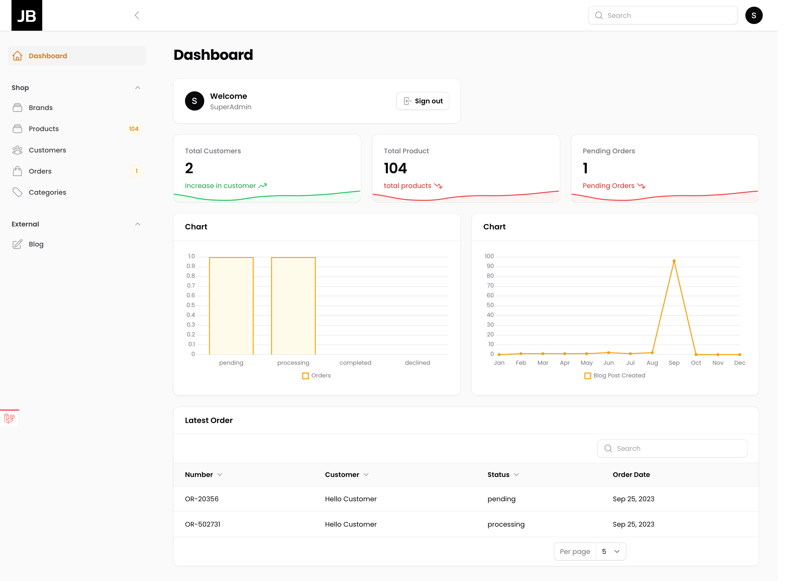

# Shopping Admin Panel with Laravel FilamentPHP Version3

Welcome to the Shopping Admin Panel powered by Laravel and FilamentPHP. This admin panel is designed to streamline the management of your e-commerce website or application.

## Screenshot


## Features

- **User Management:** Easily add, modify, or remove user accounts with different roles and permissions.

- **Product Management:** Manage your product catalog effortlessly, including adding, updating, and categorizing items.

- **Order Tracking:** Keep tabs on customer orders, update their status, and manage order details.

- **Inventory Control:** Keep track of product quantities in real-time, ensuring you never oversell.

- **Reporting:** Access insightful reports to analyze your sales, customer data, and product performance.

## Installation

1. Clone this repository to your local environment.
   ```bash
   git clone https://github.com/tpjigar/filament_v3.git
   ```

2. Install dependencies using Composer.
   ```bash
   composer install
   ```

3. Copy the `.env.example` file to `.env` and configure your environment variables, including database settings.

4. Generate an application key.
   ```bash
   php artisan key:generate
   ```

5. Migrate and seed the database.
   ```bash
   php artisan migrate --seed
   ```

6. Start the development server.
   ```bash
   php artisan serve
   ```

7. Access the admin panel at `http://localhost:8000/admin`.

## Usage

- Log in with the default admin credentials (or create your own):
    - **Email:** admin@admin.com
    - **Password:** password

- Start managing your e-commerce business efficiently with the Shopping Admin Panel.

## Customization

You can easily customize and extend this admin panel to meet the specific needs of your project. FilamentPHP provides a flexible and modular structure for building tailored admin interfaces.

For more information, visit the [FilamentPHP Documentation](https://filament.app/docs/).

## License

This project is open-source and available under the [MIT License](LICENSE). Feel free to use, modify, and distribute it as needed.

If you have any questions or need assistance, please reach out to the project maintainers or the FilamentPHP community.
